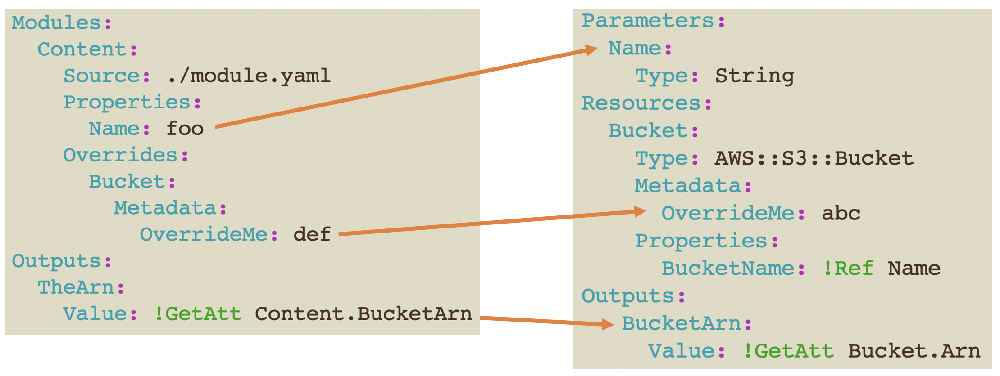
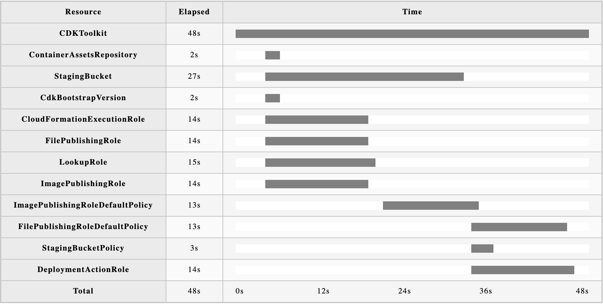

[](https://github.com/aws-cloudformation/rain/actions/workflows/test.yml)
[](https://github.com/aws-cloudformation/awesome-cloudformation)

# Rain

* Documentation: <https://aws-cloudformation.github.io/rain/>

> Rain is what happens when you have a lot of CloudFormation

Rain is also a command line tool for working with [AWS CloudFormation](https://aws.amazon.com/cloudformation/) templates and stacks.

[](https://asciinema.org/a/vtbAXkriC0zg0T2UzP0t63G4S?autoplay=1)

## Discord

Join us on Discord to discuss rain and all things CloudFormation! Connect and interact with CloudFormation developers and
experts, find channels to discuss rain, the CloudFormation registry, StackSets,
cfn-lint, Guard and more:

[](https://discord.gg/9zpd7TTRwq)

## Key features

* **Interactive deployments**: With `rain deploy`, rain packages your CloudFormation templates, prompts you for any parameters that have not yet been defined, shows you a summary of the changes that will be made, and then displays real-time updates as your stack is being deployed. Once finished, you get a summary of the outcome along with any error messages collected along the way - including errors messages for stacks that have been rolled back and no longer exist.

* **Consistent formatting of CloudFormation templates**: Using `rain fmt`, you can format your CloudFormation templates to a consistent standard or reformat a template from JSON to YAML (or YAML to JSON if you prefer). Rain preserves your comments when using YAML and switches use of [intrinsic functions](https://docs.aws.amazon.com/AWSCloudFormation/latest/UserGuide/intrinsic-function-reference.html) to use the short syntax where possible.

* **Combined logs for nested stacks with sensible filtering**: When you run `rain log`, you will see a combined stream of logs from the stack you specified along with any nested stack associated with it. Rain also filters out uninteresting log messages by default so you just see the errors that require attention. You can also use `rain log --chart` to see a Gantt chart that shows you how long each operation took for a given stack.

* **Build new CloudFormation templates**: `rain build` generates new CloudFormation templates containing skeleton resources that you specify. This saves you having to look up which properties are available and which are required vs. optional. Build skeleton templates by specifying a resource name like `AWS::S3::Bucket`, or enable the Bedrock Claude model in your account to use generative AI with a command like `rain build --prompt "A VPC with 2 subnets"`. (Note that Bedrock is not free, and requires some [setup](https://docs.aws.amazon.com/bedrock/latest/userguide/model-access.html)). **NEW** Use the `rain build --recommend` command to pick from a list of functional templates that will pass typical compliance checks by default. These templates are great starting points for infrastructure projects.

* **Build policy validation files**: The `rain build` command can now send prompts to the Bedrock Cloude3 Haiku and Sonnet models, which can write Open Policy Agent (OPA) Rego files or CloudFormation Guard files, to verify the compliance of your templates

* **Manipulate CloudFormation stack sets**: `rain stackset deploy` creates a new stackset, updates an existing one or adds a stack instance(s) to an existing stack set. You can list stack sets using `rain stackset ls`, review stack set details with `rain stackset ls <stack set name>` and delete stack set and\or its instances with `rain stackset rm <stack set name>`

* **Predict deployment failures** (EXPERIMENTAL): `rain forecast` analyzes a template and the target deployment account to predict things that might go wrong when you attempt to create, update, or delete a stack. This command speeds up development by giving you advanced notice for issues like missing permissions, resources that already exist, and a variety of other common resource-specific deployment blockers.

* **Modules** (EXPERIMENTAL): `rain pkg` supports client-side module development. Rain modules are partial templates that are inserted into the parent template, with some extra functionality added to enable extending existing resource types. This feature integrates with CodeArtifact to enable package publish and install.

* **Content Deployment** (EXPERIMENTAL): `rain deploy` and `rain rm` support metadata commands that can upload static assets to a bucket and then delete those assets when the bucket is deleted. Rain can also run build scripts before and after stack deployment to prepare content like web sites and lambda functions before uploading to S3.

_Note that in order to use experimental commands, you have to add `--experimental` or `-x` as an argument._

## Getting started

If you have [homebrew](https://brew.sh/) installed, `brew install rain`

Or you can download the appropriate binary for your system from [the releases page](https://github.com/aws-cloudformation/rain/releases).

Or if you're a [Gopher](https://blog.golang.org/gopher), you can `go install github.com/aws-cloudformation/rain/cmd/rain@latest`

```
Usage:
  rain [command]

Stack commands:
  cat         Get the CloudFormation template from a running stack
  cc          Interact with templates using Cloud Control API instead of CloudFormation
  deploy      Deploy a CloudFormation stack or changeset from a local template
  logs        Show the event log for the named stack
  ls          List running CloudFormation stacks or changesets
  rm          Delete a CloudFormation stack or changeset
  stackset    This command manipulates stack sets.
  watch       Display an updating view of a CloudFormation stack

Template commands:
  bootstrap   Creates the artifacts bucket
  build       Create CloudFormation templates
  diff        Compare CloudFormation templates
  fmt         Format CloudFormation templates
  forecast    Predict deployment failures
  merge       Merge two or more CloudFormation templates
  module      Interact with Rain modules in CodeArtifact
  pkg         Package local artifacts into a template
  tree        Find dependencies of Resources and Outputs in a local template

Other Commands:
  console     Login to the AWS console
  help        Help about any command
  info        Show your current configuration
```

You can find shell completion scripts in [docs/bash_completion.sh](./docs/bash_completion.sh) and [docs/zsh_completion.sh](./docs/zsh_completion.sh).

## Contributing

Rain is written in [Go](https://golang.org/) and uses the [AWS SDK for Go v2](https://github.com/aws/aws-sdk-go-v2).

To contribute a change to Rain, [fork this repository](https://github.com/aws-cloudformation/rain/fork), make your changes, and submit a Pull Request.

### Go Generate

The `README.md`, documentation in `docs/`, the auto completion scripts and a copy of the cloudformation specification in `cft/spec/cfn.go` are generated through `go generate`.

## License

Rain is licensed under the Apache 2.0 License. 

## Example Usage

### Specifying Parameter and Tag Values via File

The config flag can be used to programmatically set tags and parameters. The
format is similar to the "Template configuration file" for AWS CodePipeline
just without the 'StackPolicy' key. The file can be in YAML or JSON format.

JSON:
```json
{
  "Parameters" : {
    "NameOfTemplateParameter1" : "ValueOfParameter1",
    "NameOfTemplateParameter2" : "ValueOfParameter2"
  },
  "Tags" : {
    "TagKey1" : "TagValue1",
    "TagKey2" : "TagValue2"
  }
}
```

YAML:
```yaml
Parameters:
  NameOfTemplateParameter1: ValueOfParameter1
  NameOfTemplateParameter2: ValueOfParameter2
Tags:
  TagKey1: TagValue1
  TagKey2: TagValue2
```

### Packaging

The `rain pkg` command can be used as a replacement for the `aws cloudformation
package` CLI command.  When packaging a template, `rain` looks for specific
directives to appear in resources.

#### Embed

The `!Rain::Embed` directive simply inserts the contents of a file into the template as a string.

The template:

```yaml
Resources:
  Test:
    Type: AWS::CloudFormation::WaitConditionHandle
    Metadata:
      Comment: !Rain::Embed embed.txt
```
The contents of `embed.txt`, which is in the same directory as the template:

```txt
This is a test
```

The resulting packaged template:

```yaml
Resources:
  Test:
    Type: AWS::CloudFormation::WaitConditionHandle
    Metadata:
      Comment: This is a test
```

#### Include

The `!Rain::Include` directive parses a YAML or JSON file and inserts the object into the template.

The template:

```yaml
Resources:
  Test:
    !Rain::Include include-file.yaml
```

The file to be included:

```yaml
Type: AWS::S3::Bucket
Properties:
  BucketName: test
```

The resulting packaged template:

```yaml
Resources:
  Test:
    Type: AWS::S3::Bucket
    Properties:
      BucketName: test
```

#### Env

The `!Rain::Env` directive reads environment variables and inserts them into the template as strings.

The template:

```yaml
Resources:
  Test:
    Type: AWS::S3::Bucket
    Properties:
      BucketName: !Rain::Env BUCKET_NAME
```

The resulting packaged template, if you have exported an environment variable named `BUCKET_NAME` with value `abc`:

```yaml
Resources:
  Test:
    Type: AWS::S3::Bucket
    Properties:
      BucketName: abc
```

#### S3Http

The `!Rain::S3Http` directive uploads a file or directory to S3 and inserts the
HTTPS URL into the template as a string.

The template:

```yaml
Resources:
  Test:
    Type: A::B::C
    Properties:
      TheS3URL: !Rain::S3Http s3http.txt
```

If you have a file called `s3http.txt` in the same directory as the template,
rain will use your current default profile to upload the file to the artifact
bucket that rain creates as a part of bootstrapping. If the path provided is a 
directory and not a file, the directory will be zipped first.

```yaml
Resources:
  Test:
    Type: A::B::C
    Properties:
      TheS3URL: https://rain-artifacts-012345678912-us-east-1.s3.us-east-1.amazonaws.com/a84b588aa54068ed4b027b6e06e5e0bb283f83cf0d5a6720002d36af2225dfc3
```

#### S3 

The `!Rain::S3` directive is basically the same as `S3Http`, but it inserts the S3 URI instead of an HTTPS URL.

The template:

```yaml
Resources:
  Test:
    Type: A::B::C
    Properties:
      TheS3URI: !Rain::S3 s3.txt
```

If you have a file called `s3.txt` in the same directory as the template,
rain will use your current default profile to upload the file to the artifact
bucket that rain creates as a part of bootstrapping. If the path provided is a 
directory and not a file, the directory will be zipped first.

```yaml
Resources:
  Test:
    Type: A::B::C
    Properties:
      TheS3URI: s3://rain-artifacts-755952356119-us-east-1/a84b588aa54068ed4b027b6e06e5e0bb283f83cf0d5a6720002d36af2225dfc3 
```

If instead of providing a path to a file, you supply an object with properties, you can exercise more control over how the object is uploaded to S3. The following example is a common pattern for uploading Lambda function code. The optional `Run` property is a local script that you want Rain to run before uploading the content at `Path`.

```yaml
Resources:
  MyFunction:
    Type: AWS::Lambda::Function
    Properties:
      Code: !Rain::S3 
        Path: lambda-dist
        Zip: true
        BucketProperty: S3Bucket
        KeyProperty: S3Key
        Run: buildscript.sh
```

The packaged template:

```yaml
Resources:
  MyFunction:
    Type: AWS::Lambda::Function
    Properties:
      Code:
        S3Bucket: rain-artifacts-012345678912-us-east-1
        S3Key: 1b4844dacc843f09941c11c94f80981d3be8ae7578952c71e875ef7add37b1a7
```

Sometimes you require that objects uploaded to S3 have a specific extension, use the `Extension` property to ensure the artifact in S3 ends .<Extension>.

```yaml
Resources:
  Test:
    Type: A::B::C
    Properties:
      TheS3URI: !Rain::S3
        Path: test
        Extension: sh
```

The packaged template:

```yaml
Resources:
  Test:
    Type: A::B::C
    Properties:
      TheS3URI: s3://rain-artifacts-012345678912-us-east-1/a84b588aa54068ed4b027b6e06e5e0bb283f83cf0d5a6720002d36af2225dfc3.sh
```

#### Metadata commands

You can add a metadata section to an `AWS::S3::Bucket` resource to take additional actions during deployment, such as running pre and post build scripts, uploading content to the bucket after stack deployment completes, and emptying the contents of the bucket when the stack is deleted.

```yaml
Resources:
  Bucket:
    Type: AWS::S3::Bucket
    Metadata:
      Rain:
        EmptyOnDelete: true
        Content: site/dist
        Version: 2
        DistributionLogicalId: SiteDistribution
        RunBefore: 
          Command: buildsite.sh
          Args:
          - ALiteralArgument
        RunAfter:
          Command: buildsite.sh
          Args:
            - Rain::OutputValue AStackOutputKey
```

`EmptyOnDelete`: If true, the bucket's contents, including all versions, will be deleted so that the bucket itself can be deleted. This can be useful for development environments, but be careful about using it in production!

`Version`: Rain doesn't do anything with this, but incrementing the number can force the stack to deploy if there have been no infrastructure changes to the stack.

`RunBefore`: Rain will run this command before the stack deploys. Useful to run your website build script before bothering to deploy, to make sure it builds successfully.

`RunAfter`: Rain will run this command after deployment, and it is capable of doing stack output lookups to provide arguments to the script. This is useful if you deployed a resource like an API Gateway and need to know the stage URL to plug in to your website configuration. Use `Rain::OutputValue OutputKey` to pass one of the arguments to the script.

`DistributionLogicalId`: Supply the logical id of a CloudFront distribution to invalidate all files in it after the content upload completes.

See `test/webapp/README.md` for a complete example of using these commands with Rain modules.

#### Modules

You can use Rain to package templates with client-side modules, which gives
CloudFormation multi-file support. This feature is compatible with (upcoming)
functionality in the AWS CLI `cloudformation package` command. This feature is
still considered experimental, so you need to use the `--experimental` flag to
use it. The UX is fairly stable at this point, but we still reserve the right
to change the behavior in a minor version release.

The `rain pkg` command does not actually deploy any resources if the template
does not upload any objects to S3, so you always have a chance to review the
packaged template. It's recommended to run linters and scanners on the packaged
template, rather than a pre-processed template that makes use of these advanced
directives. (We are working on native support for modules in cfn-lint and in
IDE plugins)

A prior version of modules in Rain made use of the `Rain::Module` resource type
directive, which is still available for backwards compatibility.

Modules are imported into the parent template or parent module via a new
`Modules` section. This is a departure from registry modules and from the prior
version of Rain modules, which are configured as resources. 

```
Modules:
  Content:
    Source: ./module.yaml
```

Modules are very similar to CloudFormation templates. They support
`Parameters`, `Resources`, `Conditions`, and `Outputs`. `Parameters` are
configured with the `Properties` attribute in the parent, and act much like
normal parameters, except it is possible to pass in objects and lists to a
module. Any valid CloudFormation template can be used as a module.



A sample module:

```
Parameters:
  Name:
    Type: Scalar
Resources:
  Bucket:
    Type: AWS::S3::Bucket
    Metadata:
      OverrideMe: abc
    Properties:
      BucketName: !Ref Name
Outputs:
   BucketArn: 
    Value: !GetAtt Bucket.Arn
```

The `Outputs` of a module are reference-able in the parent by using `GetAtt` or `Sub` for scalars and `Ref` for objects.

An example of using the module above:

```
Modules:
  Content:
    Source: ./module.yaml
    Properties:
      Name: foo
    Overrides:
      Bucket:
        Metadata:
          OverrideMe: def
Outputs:
  TheArn:
    Value: !GetAtt Content.BucketArn
```

The `Overrides` attribute is a new feature that distinguishes local modules
from registry modules. This allows the consumer to override content from the
module that is included in the parent template, if they know the internal
structure of the module. Instead of forcing a module author to anticipate every
possible use case with numerous parameters, the author can focus on basic use
cases and allow the consumer to get creative if they want to change certain
elements of the output. Using `Overrides` carries a risk of breaking changes
when a module author changes things, so it will generally be safer to rely on
`Parameters` and `References`, but the overrides provide a flexible and
easy-to-use escape hatch that can solve some tricky design challenges
associated with a declarative language like YAML.

The packaged output of the above template:

```
Resources:
  ContentBucket:
    Type: AWS::S3::Bucket
    Metadata:
      OverrideMe: def
    Properties:
      BucketName: foo
```

You can also define constant values in modules. The `Constants` section is a
simple key-value list of strings or objects that are referred to later with
`Fn::Sub` or `Ref`. When referencing an object, only the entire object can be
referenced, not any sub-elements of the object.

```
Constants:
  S3Arn: "arn:${AWS::Partition}:s3:::"
  BucketName: "${Name}-${AWS::Region}-${AWS::AccountId}"
  BucketArn: "${Const::S3Arn}${Const::BucketName}"
  AnObject:
    Foo: bar
```

Before any processing of the template happens, all instances of constants in
`!Sub` strings are replaced, including in subsequent constant declarations.
Constant references are prefixed by `Const::`. Constants are supported not
just in modules, but in the parent template as well. For constants that are
objects, they are referenced with `!Ref Const::name`. 

After constants are processed, the `Modules` section is processed. Module
source files are specified using a path that is relative to the parent template
or module. The path is not relative to where the `package` command is being
run. So, if a module is in the same directory as the parent, it is simply
referred to as `module.yaml` or `./module.yaml`. Modules can also reference an
HTTPS URL as the source location.

Modules can contain other modules, with no enforced maximum limit on nesting.
Modules are not allowed to refer to themselves directly or in cycles. Module A
can’t import Module A, and it can’t import Module B if that module imports
Module A.

Modules support a basic form of looping/foreach by either using the familiar
`Fn::ForEach` syntax, or with a shorthand by adding a `ForEach` attribute to
the module configuration. Special variables `$Identifier` and `$Index` can be
used to refer to the value and list index. With the shorthand, or if you don't
put the Identifier in the logical id, logical ids are auto-incremented by
adding an integer starting at zero. Since this is a client-side-only feature,
list values must be fully resolved scalars, not values that must be resolved at
deploy time. 

```
Parameters:
  List:
    Type: CommaDelimitedList
    Default: A,B,C

Modules:
  Content:
    Source: ./map-module.yaml
    ForEach: !Ref List
    Properties:
      Name: !Sub my-bucket-$MapValue
```

Assuming the module itself simply creates a bucket, the output would be:

```
Parameters:
  List: 
    Type: CommaDelimitedList  
    Default: A,B,C
Resources:  
  Content0Bucket:
    Type: AWS::S3::Bucket
    Properties:
      BucketName: my-bucket-A
  Content1Bucket:
    Type: AWS::S3::Bucket
    Properties:
      BucketName: my-bucket-B
  Content2Bucket:
    Type: AWS::S3::Bucket
    Properties:
      BucketName: my-bucket-C
```

It’s also possible to refer to elements within a `Map` using something like
`!GetAtt Content[0].Arn` for a single element, or `!GetAtt Content[].Arn`,
which resolves to a list of all of the `Arn` outputs from that module.

When a module is processed, the first thing that happens is parsing of the
Conditions within the module. Any Resources, Modules, or Outputs marked with a
false condition are removed, and any property nodes with conditions are
processed. Any values of !Ref AWS::NoValue are removed. Any unresolved
conditions (for example, a condition that references a paramter in the parent
template, or something like AWS::Region) are emitted into the parent template,
prefixed with the module name.

Much of the value of module output is in the smart handling of `Ref`,
`Fn::GetAtt`, and `Fn::Sub`. For the most part, we want these to “just work” in
the way that an author would expect them to. Since the logical IDs in the
module result in a concatenation of the module name and the ID specified inside
the module, we have to modify self-references within the module. And we have to
fix up any references to parameter values, so that in the final rendered
output, they match up with actual IDs and property names.

From the parent, the author has two options for referring to module properties.
If they know the structure of the module, they can use the predicted final name
for resources, in which case we leave the strings alone. For example, in a
module that creates a bucket, if the logical id within the module is `Bucket`
and the name of the module in the parent is `Content`, the author could write
`!Ref ContentBucket` or `!GetAtt ContentBucket.BucketName`. The second, safer
way would be for the module author to specify an output reference called `Name`
that refs the bucket name, so the parent author could write `!GetAtt
Content.Name`. Module authors are encouraged to provide `Outputs` that provide
access to all needed values, but there will be cases when they cannot predict
everything a consumer needs. For `Sub` strings, if we can fully resolve the
value, we get rid of the `Fn::Sub` and simply write the string to the output.
The parent can also refer directly to the `Properties` defined for a module
import in the `Modules` section.

Complex objects are merged when an override is specified, so it’s possible to
do things like add statements to a policy without actually overwriting the
entire thing. This is usually what the author wants, but the tradeoff is that
there is no way to delete an element from a list in the module.

#### Intrinsics

As a part of this design, we are adding support for intrinsic functions that do
not exist for normal CloudFormation templates, and can only be processed by the
`package` command. We also augment the behavior of some intrinsics. These
functions are fully resolved locally and won’t need server-side support.

`Fn::Merge` merges the contents of multiple objects. This is useful for things
like tagging, where each module might want to add a set of tags, in addition to
any tags defined by the parent module. 

`Fn::Select` is collapsed if we can fully resolve the return value as a string.
We do the same for `Fn::Join`.

`Fn::InsertFile` inserts the contents of a local file directly into the
template as a string.

`Fn::Invoke` allows modules to be treated sort of like functions. A module can
be created with only `Parameters` and `Outputs`, and by using `Invoke` later,
you can get different outputs. An example use case is a module that creates
standard resource names, accepting things like `Env` and `App` and `Name` as
parameters, and returning a concatenated string. 

#### Metadata

When processing modules, the package command adds metadata to the template for
metrics gathering.

```
Metadata:
  AWSToolsMetrics:
    Rain: '{"Version":"v1.21.0","Experimental":true,"HasModules":true,"HasRainSection":false}'
```

Each rendered resource has an added Metadata property to indicate where it
originated. This can be useful for tooling such as IDE integration, and for
troubleshooting in the console.

```
Resources:
  ContentBucket:
    Metadata:
      SourceMap: "./modules/bucket.yaml:Bucket:35"
```

### Packaging

In order to reference a collection of modules, you can add a `Packages` section
to the template. Packages are zip files containing modules.

```
Packages:
  abc:
    Source: ./package.zip
  def:
    Source: https://example.com/packages/package.zip
```

Packages are referenced by using an alias to the package name that starts with `$`.

```
Modules:
  Foo:
    Source: $abc/foo.yaml
  Bar:
    Source: $def/a/b/bar.yaml
```

### Publish modules to CodeArtifact 

Rain integrates with AWS CodeArtifact to enable an experience similar to npm
publish and install. A directory that includes Rain module YAML files can be
packaged up with `rain module publish`, and then the directory can be installed
by developers with `rain module install`.


A module package is published and released from this repository separately from
the Rain binary release. This allows the package to be referenced by version
numbers using tags, such as `m0.1.0` as shown in the example above. The major
version number will be incremented if any breaking changes are introduced to
the modules. The available modules in the release package are listed below.
Treat these modules as samples to be used as a proof-of-concept for building
your own module packages.

#### simple-vpc.yaml

A VPC with just two availability zones. This module is useful for POCs and simple projects.

#### encrypted-bucket.yaml

A simple bucket with encryption enabled and public access blocked

#### compliant-bucket.yaml

A bucket, plus extra buckets for access logs and replication and a bucket policy that should pass most typical compliance checks.

#### bucket-policy.yaml

A bucket policy that denies requests not made with TLS.

#### load-balancer.yaml

An ELBv2 load balancer

#### static-site.yaml

An S3 bucket and a CloudFront distribution to host content for a web site

#### cognito.yaml

A Cognito User Pool and associated resources

#### rest-api.yaml

An API Gateway REST API

#### api-resource.yaml

A Lambda function and associated API Gateway resources

### IfParam and IfNotParam

Inside a module, you can add a Metadata attribute to show or hide resources,
depending on whether the parent template sets a parameter value. This is
similar to the Conditional section in a template, but somewhat simpler, and it
only works in modules. Modules also support normal Conditions. `IfParam` is
basically just a shorthand for writing the complete Condition.

```yaml
Resources:
  Bucket:
    Type: AWS::S3::Bucket
    Metadata:
      Rain:
        IfParam: Foo
```

If the parent template does not set a value for the `Foo` property, the module will 
omit the resource. The opposite is true for `IfNotParam`. 

`IfParam` can be useful to make flexible modules that can optionally do things like 
configure permissions for related resources, like allowing access to a bucket or table.

`IfNotParam` is useful if you have pre-created a resource and you don't want the module 
to create it for you.

### Gantt Chart

Output a chart to an HTML file that you can view with a browser to look at how long stack operations take for each resource.

`rain log --chart CDKToolkit > ~/Desktop/chart.html`



### Pkl

You can now write CloudFormation templates in Apple's new configuration
language, Pkl. Rain commands that accept input as JSON or YAML now also accept
files with the `.pkl` extension. We host a Pkl package in a [separate
repo](https://github.com/aws-cloudformation/cloudformation-pkl) that is
generated based on the CloudFormation registry. This package has classes that
can be imported for each registry resource type, in addition to higher level
patterns. This allows you to write a type-safe template and create your own
client-side modules, in a way that is similar to CDK, but with declarative
code.

Example Pkl template:

```pkl
amends "package://github.com/aws-cloudformation/cloudformation-pkl/releases/download/cloudformation@0.1.1/cloudformation@0.1.1#/template.pkl"
import "package://github.com/aws-cloudformation/cloudformation-pkl/releases/download/cloudformation@0.1.1/cloudformation@0.1.1#/cloudformation.pkl" as cfn
import "package://github.com/aws-cloudformation/cloudformation-pkl/releases/download/cloudformation@0.1.1/cloudformation@0.1.1#/aws/s3/bucket.pkl" as bucket

Description = "Create a bucket"

Parameters {
    ["Name"] {
        Type = "String"
        Default = "baz"
    }
}

Resources {
    ["MyBucket"] = new bucket.Bucket {
        BucketName = cfn.Ref("Name")
    }
}
```

## Constants

You can put constants into the `Rain` section in the template and then refer to
those constants later in the template. Constants can be strings or entire
objects (but only strings can be used later in Sub functions). Use the
`!Rain::Constant` directive to refer to a constant in the template. For
strings, you can add constants to `!Sub` strings with the
`${Rain::ConstantName}` pseudo-parameter. Constants can contain previosuly
declared constants in Sub strings using the same format. The `Rain` section
gets removed during packaging.

```yaml
Parameters:
  Prefix:
    Type: String

Rain:
  Constants:
    Test1: ezbeard-rain-test-constants
    Test2: !Sub ${Prefix}-${Rain::Test1}-SubTest

Resources:
  Bucket:
    Type: AWS::S3::Bucket
    Properties:
      BucketName: !Rain::Constant Test1

  Bucket2:
    Type: AWS::S3::Bucket
    Properties:
      BucketName: !Rain::Constant Test2

  Bucket3:
    Type: AWS::S3::Bucket
    Properties:
      BucketName: !Sub "pre-${Prefix}-${Rain::Test1}-suffix" 
```

Run `rain pkg` on that template to produce the following output:

```yaml
Parameters:
  Prefix:
    Type: String

Resources:
  Bucket:
    Type: AWS::S3::Bucket
    Properties:
      BucketName: ezbeard-rain-test-constants

  Bucket2:
    Type: AWS::S3::Bucket
    Properties:
      BucketName: !Sub ${Prefix}-ezbeard-rain-test-constants-SubTest

  Bucket3:
    Type: AWS::S3::Bucket
    Properties:
      BucketName: !Sub pre-${Prefix}-ezbeard-rain-test-constants-suffix
```


## Other CloudFormation tools

* [cfn-lint](https://github.com/aws-cloudformation/cfn-python-lint)

    Validate CloudFormation yaml/json templates against the CloudFormation spec and additional checks. Includes checking valid values for resource properties and best practices.

* [cfn-guard](https://docs.aws.amazon.com/cfn-guard/latest/ug/what-is-guard.html)

    Guard is a policy evaluation tool that allows you to build your own rules with a custom DSL. You can also pull rules from the 
    [guard registry](https://github.com/aws-cloudformation/aws-guard-rules-registry) to scan your templates for resources that don't comply with common best practices.

* [taskcat](https://github.com/aws-quickstart/taskcat)

    taskcat is a tool that tests AWS CloudFormation templates. It deploys your AWS CloudFormation template in multiple AWS Regions and generates a report with a pass/fail grade for each region. You can specify the regions and number of Availability Zones you want to include in the test, and pass in parameter values from your AWS CloudFormation template. taskcat is implemented as a Python class that you import, instantiate, and run.

Are we missing an excellent tool? Let us know via a GitHub issue.

