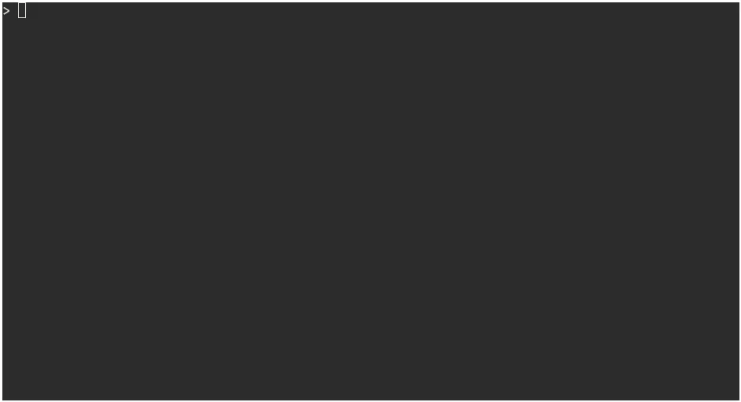

# Rain

Rain is a development workflow tool for working with AWS CloudFormation.

*Rain is currently in preview and shouldn't yet be considered stable enough for production use. Please report any bugs you find [through GitHub issues](https://github.com/aws-cloudformation/rain/issues).*

> Rain is also what happens when you have a lot of CloudFormation

Here's what it looks like:



## Installing

You can download the appropriate binary for your system from [the releases page](https://github.com/aws-cloudformation/rain/releases).

Alternatively, [Go](https://golang.org) (v1.12 or higher) installed:

`GO111MODULE=on go get github.com/aws-cloudformation/rain`

## License

This library is licensed under the Apache 2.0 License. 

## Usage

You will need to make sure you have installed and configured [the AWS CLI](https://docs.aws.amazon.com/cli/latest/userguide/cli-chap-welcome.html) as rain uses the same credentials and configuration.

Rain is composed of a number of sub-commands. Invoke a command like this:

```
rain [command] [arguments...]
```

The following commands are available:

```
cat         Get the CloudFormation template from a running stack
check       Show your current configuration
deploy      Deploy a CloudFormation stack from a local template
diff        Compare CloudFormation templates
logs        Show the event log for the named stack
ls          List running CloudFormation stacks
rm          Delete a running CloudFormation stack
```

You can get additional information about any command by running:

```
rain help [command]
```
