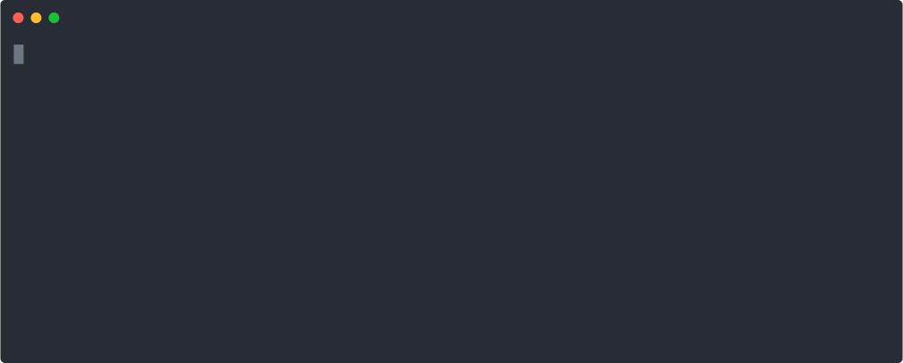

[](https://github.com/aws-cloudformation/rain/actions/workflows/test.yml)
[](https://github.com/aws-cloudformation/awesome-cloudformation)

# Rain

* Documentation: <https://aws-cloudformation.github.io/rain/>

> Rain is what happens when you have a lot of CloudFormation

Rain is also a command line tool for working with [AWS CloudFormation](https://aws.amazon.com/cloudformation/) templates and stacks.

[](https://asciinema.org/a/vtbAXkriC0zg0T2UzP0t63G4S?autoplay=1)

## Discord

Join us on Discord to discuss rain and all things CloudFormation! Connect and interact with CloudFormation developers and
experts, find channels to discuss rain, the CloudFormation registry, StackSets,
cfn-lint, Guard and more:

[](https://discord.gg/9zpd7TTRwq)

## Key features

* **Interactive deployments**: With `rain deploy`, rain packages your CloudFormation templates using [`aws cloudformation package`](https://awscli.amazonaws.com/v2/documentation/api/latest/reference/cloudformation/package.html), prompts you for any parameters that have not yet been defined, shows you a summary of the changes that will be made, and then displays real-time updates as your stack is being deployed. Once finished, you get a summary of the outcome along with any error messages collected along the way - including errors messages for stacks that have been rolled back and no longer exist.

* **Consistent formatting of CloudFormation templates**: Using `rain fmt`, you can format your CloudFormation templates to a consistent standard or reformat a template from JSON to YAML (or YAML to JSON if you prefer). Rain preserves your comments when using YAML and switches use of [intrinsic functions](https://docs.aws.amazon.com/AWSCloudFormation/latest/UserGuide/intrinsic-function-reference.html) to use the short syntax where possible.

* **Combined logs for nested stacks with sensible filtering**: When you run `rain log`, you will see a combined stream of logs from the stack you specified along with any nested stack associated with it. Rain also filters out uninteresting log messages by default so you just see the errors that require attention.

* **Build new CloudFormation templates**: `rain build` generates new CloudFormation templates containing skeleton resources that you specify. This saves you having to look up which properties are available and which are required vs. optional.

* **Manipulate CloudFormation stack sets**: `rain stackset deploy` creates a new stackset, updates an existing one or adds a stack instance(s) to an existing stack set. You can list stack sets using `rain stackset ls`, review stack set details with `rain stackset ls <stack set name>` and delete stack set and\or its instances with `rain stackset rm <stack set name>`

## Getting started

If you have [homebrew](https://brew.sh/) installed, `brew install rain`

Or you can download the appropriate binary for your system from [the releases page](https://github.com/aws-cloudformation/rain/releases).

Or if you're a [Gopher](https://blog.golang.org/gopher), you can `GO111MODULE=on go get github.com/aws-cloudformation/rain/cmd/rain`

```
Usage:
  rain [command]

Stack commands:
  cat         Get the CloudFormation template from a running stack
  deploy      Deploy a CloudFormation stack from a local template
  logs        Show the event log for the named stack
  ls          List running CloudFormation stacks
  rm          Delete a running CloudFormation stack
  stackset    This command manipulates stack sets.
  watch       Display an updating view of a CloudFormation stack

Template commands:
  build       Create CloudFormation templates
  diff        Compare CloudFormation templates
  fmt         Format CloudFormation templates
  merge       Merge two or more CloudFormation templates
  pkg         Package local artifacts into a template
  tree        Find dependencies of Resources and Outputs in a local template

Other Commands:
  console     Login to the AWS console
  help        Help about any command
  info        Show your current configuration
```

You can find shell completion scripts in [docs/bash_completion.sh](./docs/bash_completion.sh) and [docs/zsh_completion.sh](./docs/zsh_completion.sh).

## Contributing

Rain is written in [Go](https://golang.org/) and uses the [AWS SDK for Go v2](https://github.com/aws/aws-sdk-go-v2).

To contribute a change to Rain, just [fork this repository](https://github.com/aws-cloudformation/rain/fork), make your changes, and submit a Pull Request.

### Go Generate

The `README.md`, documentation in `docs/`, the auto completion scripts and a copy of the cloudformation specification in `cft/spec/cfn.go` are generated through `go generate`.

## License

Rain is licensed under the Apache 2.0 License. 

---

## Other CloudFormation tools

In alphabetical order:

* [cfn-flip](https://github.com/awslabs/aws-cfn-template-flip)

    cfn-flip converts AWS CloudFormation templates between JSON and YAML formats, making use of the YAML format's short function syntax where possible.

* [cfn-format](https://github.com/awslabs/aws-cloudformation-template-formatter)

    cfn-format reads in an existing AWS CloudFormation template and outputs a cleanly-formatted, easy-to-read copy of the same template adhering to standards as used in AWS documentation. cfn-format can output either YAML or JSON as desired.

* [cfn-lint](https://github.com/aws-cloudformation/cfn-python-lint)

    Validate CloudFormation yaml/json templates against the CloudFormation spec and additional checks. Includes checking valid values for resource properties and best practices.

* [cfn-nag](https://github.com/stelligent/cfn_nag)

    The cfn-nag tool looks for patterns in CloudFormation templates that may indicate insecure infrastructure.

* [cfn-skeleton](https://github.com/awslabs/aws-cloudformation-template-builder)

    cfn-skeleton that consumes the published CloudFormation specification and generates skeleton CloudFormation templates with mandatory and optional parameters of chosen resource types pre-filled with placeholder values.

* [sceptre](https://sceptre.cloudreach.com/)

    Sceptre is a tool to drive CloudFormation. Sceptre manages the creation, update and deletion of stacks while providing meta commands which allow users to retrieve information about their stacks.

* [taskcat](https://github.com/aws-quickstart/taskcat)

    taskcat is a tool that tests AWS CloudFormation templates. It deploys your AWS CloudFormation template in multiple AWS Regions and generates a report with a pass/fail grade for each region. You can specify the regions and number of Availability Zones you want to include in the test, and pass in parameter values from your AWS CloudFormation template. taskcat is implemented as a Python class that you import, instantiate, and run.

Are we missing an excellent tool? Let us know via a GitHub issue.
